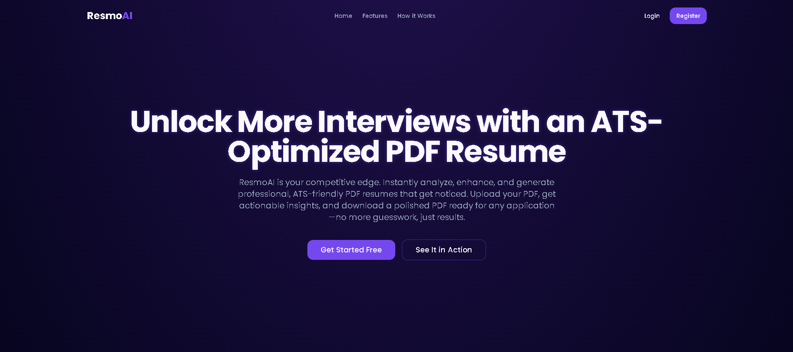
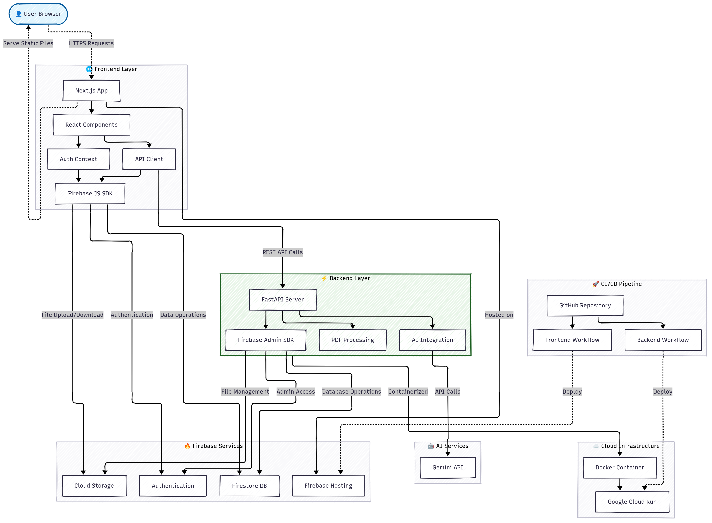
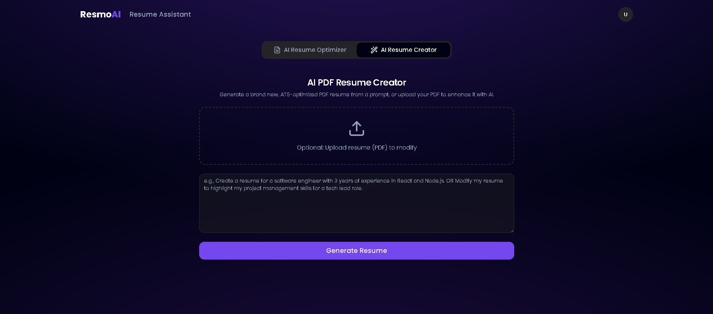
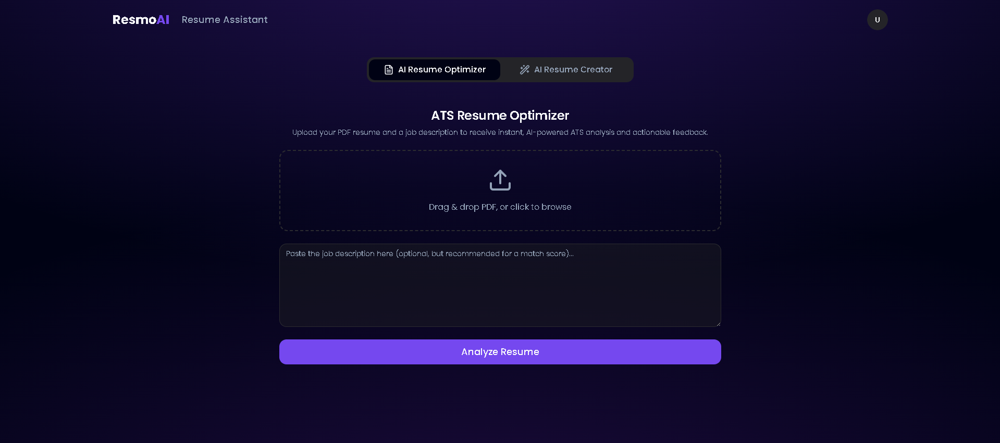

# ResmoAI

**Unlock More Interviews with an ATS-Optimized PDF Resume**

[](https://nextjs.org/)
[](https://www.typescriptlang.org/)
[](https://tailwindcss.com/)
[](https://firebase.google.com/)
[](https://cloud.google.com/run)
[](https://fastapi.tiangolo.com/)
[](https://www.docker.com/)
[](https://github.com/features/actions)
[](https://ai.google.dev/gemini-api)

---

ResmoAI is a full-stack, production-grade web application that leverages AI to help users analyze, optimize, and generate professional, ATS-friendly PDF resumes. The platform is built with a modern tech stack, including Next.js for the frontend, FastAPI for the backend, Firebase for authentication, database and storage, and Google Cloud Run for scalable backend deployment. CI/CD is fully automated with GitHub Actions.

---

## Table of Contents
- [Project Overview](#project-overview)
- [Architecture](#architecture)
- [Tech Stack](#tech-stack)
- [Features](#features)
- [Frontend](#frontend)
  - [Setup & Development](#frontend-setup--development)
  - [Environment Variables](#frontend-environment-variables)
  - [Firebase Hosting Deployment](#firebase-hosting-deployment)
- [Backend](#backend)
  - [Setup & Development](#backend-setup--development)
  - [Dockerization](#dockerization)
  - [Cloud Run Deployment](#cloud-run-deployment)
- [Firebase Integration](#firebase-integration)
  - [Authentication](#authentication)
  - [Firestore Database](#firestore-database)
  - [Storage](#storage)
- [CI/CD with GitHub Actions](#cicd-with-github-actions)
- [Environment Variables Reference](#environment-variables-reference)
- [Advanced Usage](#advanced-usage)
- [Troubleshooting & FAQ](#troubleshooting--faq)
- [Security Best Practices](#security-best-practices)
- [Scalability & Performance](#scalability--performance)
- [Contributing](#contributing)
- [License](#license)
- [Credits](#credits)

---

## Project Overview
ResmoAI empowers users to:
- Upload their PDF resume and receive instant, AI-powered feedback and optimization.
- Generate new, ATS-optimized PDF resumes from a prompt.
- Store and manage resumes securely with Firebase Storage and Firestore.
- Enjoy a seamless, modern user experience with authentication and real-time updates.

Live Demo: [https://resmoai.web.app/](https://resmoai.web.app/)



---

## Architecture



### Data Flow
- **Frontend** communicates with the backend via RESTful API endpoints and directly with Firebase for authentication and storage.
- **Backend** processes PDF files, interacts with AI services, and securely accesses Firebase using a service account.
- **CI/CD** ensures that every code change is automatically tested, built, and deployed to production.

### Deployment Diagram
- **Frontend:** Deployed as a static site to Firebase Hosting, globally distributed via CDN.
- **Backend:** Deployed as a Docker container to Google Cloud Run, auto-scales based on demand.
- **Firebase:** Centralized authentication, storage, and database for all user data and files.

---

## Tech Stack
- **Frontend:** Next.js (React, TypeScript, TailwindCSS)
- **Backend:** FastAPI (Python)
- **Database:** Firestore (Firebase)
- **Storage:** Firebase Storage
- **Authentication:** Firebase Auth
- **AI Integration:** Gemini API
- **Hosting:** Firebase Hosting (frontend), Google Cloud Run (backend)
- **CI/CD:** GitHub Actions
- **Containerization:** Docker
- **Other Tools:**
  - React Hook Form, Zod (form validation)
  - Lucide React (icons)
  - Recharts (data visualization)
  - Radix UI (accessible UI components)
  - Markdown2, xhtml2pdf, PyPDF2 (PDF/Markdown processing)

---

## Features
- **AI-Powered Resume Analysis:** Upload a PDF, get instant, actionable feedback.
- **Effortless Resume Creation:** Generate a new PDF resume from a prompt.
- **Job Description Match Scoring:** See how well your resume matches a job description.
- **Instant PDF Download:** Download your optimized resume as a PDF.
- **Authentication:** Secure login/register with Firebase Auth.
- **User Data Management:** Store user data and resume history in Firestore.
- **Cloud-Native:** Scalable, secure, and production-ready deployment.
- **Responsive Design:** Fully mobile-friendly and accessible.





---

## Frontend

### Frontend Setup & Development

1. **Install dependencies:**
   ```bash
   cd frontend
   npm install
   ```
2. **Configure environment variables:**
   - Create a `.env.local` file in `frontend/`:
     ```env
     NEXT_PUBLIC_FIREBASE_API_KEY=your_api_key
     NEXT_PUBLIC_FIREBASE_AUTH_DOMAIN=your_auth_domain
     NEXT_PUBLIC_FIREBASE_PROJECT_ID=your_project_id
     NEXT_PUBLIC_FIREBASE_STORAGE_BUCKET=your_storage_bucket
     NEXT_PUBLIC_FIREBASE_MESSAGING_SENDER_ID=your_messaging_sender_id
     NEXT_PUBLIC_FIREBASE_APP_ID=your_app_id
     NEXT_PUBLIC_FIREBASE_MEASUREMENT_ID=your_measurement_id
     ```
3. **Run the development server:**
   ```bash
   npm run dev
   ```
   - App runs at `http://localhost:9002` (or as configured).

### Frontend Environment Variables
- All variables must be prefixed with `NEXT_PUBLIC_` to be available in the browser.
- **Never commit `.env.local` to GitHub!**
- In CI/CD, these are set as GitHub Actions secrets/variables and written to `.env.local` at build time.
- For local development, you can use `.env.local` directly.

### Firebase Hosting Deployment
- Static export is enabled via `output: "export"` in `next.config.ts`.
- The build output is in the `out/` directory.
- Deployment is automated via GitHub Actions:
  - On push to `main`, the workflow builds, exports, and deploys to Firebase Hosting.
- Manual deploy:
  ```bash
  npm run build
  npm firebase deploy
  ```
- **Custom Domain:** You can add a custom domain in the Firebase Hosting console.

### Project Structure
```
frontend/
  src/
    app/           # Next.js app directory
    components/    # Reusable React components
    hooks/         # Custom React hooks
    lib/           # Utility libraries (Firebase, backend API, etc.)
  .firebaserc      # Firebase project config
  firebase.json    # Firebase hosting config
  .env.local       # Local environment variables (not committed)
  package.json     # Project scripts and dependencies
  ...
```

---

## Backend

### Backend Setup & Development

1. **Install dependencies:**
   ```bash
   cd backend
   python -m venv venv
   source venv/bin/activate  # or venv\Scripts\activate on Windows
   pip install -r requirements.txt
   ```
2. **Configure environment variables:**
   - Create a `.env` file in `backend/` with:
     ```env
     FIREBASE_STORAGE_BUCKET=your_bucket
     GEMINI_API_KEY=your_gemini_key
     # ...other variables as needed
     ```
   - Place your Firebase Admin SDK JSON in a secure location (not in the image).
3. **Run locally (with Docker):**
   ```bash
   docker build -t resmoai-backend .
   docker run --env-file .env -e GOOGLE_APPLICATION_CREDENTIALS=/tmp/service_account.json -v /path/to/service_account.json:/tmp/service_account.json -p 8080:8080 resmoai-backend
   ```
4. **Run locally (without Docker):**
   ```bash
   uvicorn app.main:app --host 0.0.0.0 --port 8080
   ```

### Dockerization
- The backend is containerized with a `Dockerfile`:
  - Uses Python 3.11 slim
  - Installs dependencies
  - Copies app code
  - Exposes port 8080
  - Runs FastAPI with Uvicorn, listening on `$PORT` (default 8080)

### Cloud Run Deployment
- Backend is deployed to Google Cloud Run using GitHub Actions.
- The Docker image is built and pushed to Docker Hub.
- Cloud Run is configured to mount the Firebase Admin SDK secret as a file and set environment variables.
- CI/CD workflow automates build and deploy on push to `main`.
- **Scaling:** Cloud Run auto-scales from zero to handle any number of requests.
- **Security:** Use IAM to restrict who can invoke the service (or allow unauthenticated for public APIs).
- **Logs & Monitoring:** View logs in Google Cloud Console for debugging and monitoring.

### Backend Project Structure
```
backend/
  app/
    main.py         # FastAPI entrypoint
    routes/         # API route modules
    services/       # Business logic, Firebase, PDF, AI, etc.
    models/         # Pydantic schemas
  requirements.txt  # Python dependencies
  Dockerfile        # Docker build file
  .env              # Backend environment variables (not committed)
  ...
```

---

## Firebase Integration

### Authentication
- Uses Firebase Auth for secure user registration and login.
- Supports email/password and Google sign-in.
- Auth state is managed in the frontend and passed to the backend for secure API calls.
- **Token Verification:** Backend verifies Firebase ID tokens for protected endpoints.
- **User Profiles:** User data is stored in Firestore, including display name and email.

### Firestore Database
- Stores user data, resume history, and AI analysis results.
- Backend writes results to Firestore after processing.
- **Data Model Example:**
  - `users/{userId}/resumes/{resumeId}`: Stores each user's resumes and analysis results.
  - `users/{userId}/optimizations/{optimizationId}`: Stores optimization feedback and scores.

### Storage
- User resumes and generated resumes (PDFs) are uploaded to Firebase Storage.
- Backend and frontend both interact with Storage securely.
- **Security Rules:** Only authenticated users can access their own files.
- **Public URLs:** Backend can make files public or use signed URLs for secure access.

---

## CI/CD with GitHub Actions

### Frontend
- Workflow in `.github/workflows/frontend_deploy.yml`:
  - On push to `main`, sets up Node.js, installs dependencies, creates `.env.local`, builds, and deploys to Firebase Hosting.
  - Uses `FIREBASE_TOKEN` and all `NEXT_PUBLIC_` variables as GitHub secrets.
  - **Preview Deployments:** Use preview channels for staging/testing.

### Backend
- Workflow in `.github/workflows/deploy.yml`:
  - On push to `main`, builds Docker image, pushes to registry, authenticates to GCP, and deploys to Cloud Run.
  - Uses GCP service account key, Docker Hub credentials, and all backend env vars as GitHub secrets.
  - Mounts Firebase Admin SDK secret as a file for secure backend access.
  - **Rollback:** Use Cloud Run revisions to rollback to previous versions if needed.

### Example: Adding a New Secret to GitHub Actions
1. Go to your repo → Settings → Secrets and variables → Actions → New repository secret.
2. Name: `NEXT_PUBLIC_FIREBASE_API_KEY` (or any other variable)
3. Value: (your value)
4. Reference it in your workflow as shown above.

---

## Environment Variables Reference

### Frontend (`.env.local`)
- `NEXT_PUBLIC_FIREBASE_API_KEY`
- `NEXT_PUBLIC_FIREBASE_AUTH_DOMAIN`
- `NEXT_PUBLIC_FIREBASE_PROJECT_ID`
- `NEXT_PUBLIC_FIREBASE_STORAGE_BUCKET`
- `NEXT_PUBLIC_FIREBASE_MESSAGING_SENDER_ID`
- `NEXT_PUBLIC_FIREBASE_APP_ID`
- `NEXT_PUBLIC_FIREBASE_MEASUREMENT_ID`

### Backend (`.env`)
- `FIREBASE_STORAGE_BUCKET`
- `GEMINI_API_KEY`
- `GOOGLE_APPLICATION_CREDENTIALS` (set as a file path in Cloud Run)

---

## Advanced Usage

### Custom Domain Setup
- Go to Firebase Hosting console → Add custom domain.
- Follow the instructions to verify your domain and update DNS records.
- SSL is automatically provisioned by Firebase.

### Analytics Integration
- Integrate Google Analytics or Firebase Analytics for user tracking.
- Add your analytics tracking ID to your environment variables and frontend code.

### Role-Based Access Control (RBAC)
- (Planned) Add admin roles for managing users, content, or analytics.
- Use Firestore custom claims or a dedicated roles collection.

### API Rate Limiting
- (Optional) Add rate limiting to backend endpoints using FastAPI middleware.
- Protects against abuse and DoS attacks.

### Monitoring & Alerts
- Set up Google Cloud Monitoring and Alerting for backend errors, latency, and traffic spikes.
- Use Firebase Crashlytics for frontend error reporting (optional).

---

## Troubleshooting & FAQ

### Common Issues
- **CORS Errors:**
  - Make sure your backend CORS settings allow your frontend domains.
  - Example:
    ```python
    allow_origins=["https://resmoai.web.app", "https://resmoai.firebaseapp.com"]
    ```
- **Build Failures:**
  - Check that all required environment variables are set in GitHub Actions.
  - Make sure you are using compatible versions of Next.js, Firebase, and other dependencies.
- **Firebase Auth Not Working:**
  - Ensure your Firebase project has the correct OAuth redirect URIs set up.
  - Check your API keys and Auth domain.
- **Cloud Run Container Fails to Start:**
  - Check logs in Google Cloud Console for Python errors or missing files.
  - Make sure the Firebase Admin SDK secret is mounted as a file, not as an environment variable.
- **PDF Upload/Download Issues:**
  - Check Firebase Storage security rules.
  - Ensure the backend has permission to access the storage bucket.

### FAQ
- **Can I use a different AI API?**
  - Yes, the backend is modular and can be adapted to use any AI service with a compatible API.
- **How do I add new features?**
  - Fork the repo, create a new branch, and follow the contribution guidelines.
- **How do I rollback a deployment?**
  - Use Cloud Run revisions for the backend, and Firebase Hosting preview channels for the frontend.
- **Is this project production-ready?**
  - Yes, but always review security, scaling, and cost settings before going live.

---

## Security Best Practices
- **Never commit secrets or `.env.local` to GitHub.**
- Always use GitHub Actions secrets for all sensitive variables.
- Restrict CORS origins to your production domains in production.
- Use IAM roles and least privilege for GCP service accounts.
- Regularly rotate API keys and service account credentials.
- Use HTTPS everywhere (Firebase Hosting and Cloud Run both enforce this).
- Set up monitoring and alerts for suspicious activity.
- Review Firebase security rules for Firestore and Storage.
- Enable billing alerts to avoid unexpected costs.

---

## Scalability & Performance
- **Frontend:**
  - Served via Firebase Hosting CDN for global low-latency access.
  - Static export ensures fast load times and minimal server load.
- **Backend:**
  - Cloud Run auto-scales from zero to thousands of instances based on demand.
  - Stateless containers allow for easy scaling and zero-downtime deploys.
- **Database & Storage:**
  - Firestore and Firebase Storage scale automatically with usage.
- **Best Practices:**
  - Use pagination and indexing in Firestore for large datasets.
  - Optimize PDF processing and AI calls for speed and cost.
  - Monitor cold starts in Cloud Run and adjust min instances if needed.

---

## Contributing

1. Fork the repo and clone your fork.
2. Create a new branch for your feature or bugfix.
3. Make your changes and commit with clear messages.
4. Push to your fork and open a Pull Request.
5. Follow code style and best practices.
6. For major changes, open an issue first to discuss.
7. Add or update documentation as needed.
8. Write tests for new features if possible.

---

## License

This project is licensed under the MIT License. See [LICENSE](LICENSE) for details.

---

## Credits
- Made with ❤️ by Ragiri Himadeep
- [Live App](https://resmoai.web.app/)
- [GitHub](https://github.com/yourusername/ResmoAI)

---

## Acknowledgements & Inspiration
- [Next.js Documentation](https://nextjs.org/docs)
- [FastAPI Documentation](https://fastapi.tiangolo.com/)
- [Firebase Documentation](https://firebase.google.com/docs)
- [Google Cloud Run Documentation](https://cloud.google.com/run/docs)
- [GitHub Actions Documentation](https://docs.github.com/en/actions)
- [Tailwind CSS](https://tailwindcss.com/)
- [Radix UI](https://www.radix-ui.com/)
- [Lucide Icons](https://lucide.dev/)
- [Recharts](https://recharts.org/)
- [PyPDF2](https://pypdf2.readthedocs.io/)
- [xhtml2pdf](https://github.com/xhtml2pdf/xhtml2pdf)
- [markdown2](https://github.com/trentm/python-markdown2)

---

## Contact & Support
- For questions, issues, or feature requests, open an issue on GitHub.
- For business inquiries, contact: himadeepragiri@gmail.com
- Follow the project and author on [GitHub](https://github.com/HimadeepRagiri), [LinkedIn](https://www.linkedin.com/in/ragiri-himadeep-608647291), [Twitter](https://x.com/RagiriHimadeep), [Instagram](https://www.instagram.com/himadeep421?igsh=amY5aDUwdW1rN25k)

---
